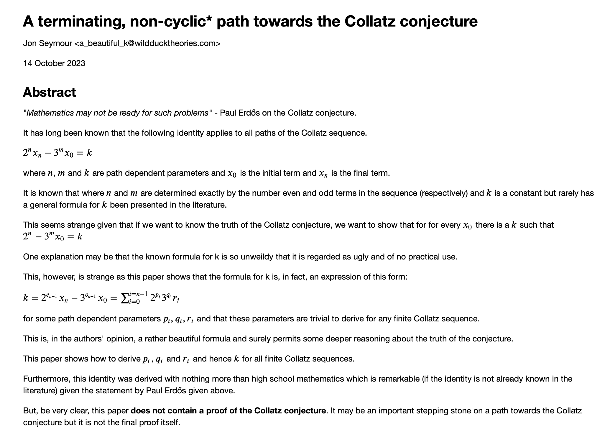

_* whatever the importance of this contribution, the title is technically not wrong - these adjectives also describe paths that fail to reach their final objective_

# paper
The paper is currently available in encrypted form [here](versions/paper-01/20231014/paper-01-20231014.encrypted.pdf).

A decrypted version of the paper will be available when a version of this paper has been published as a pre-print on [arxiv](https://arxiv.org/list/math.NT/recent) &/or the author(s) have exhausted all the interesting paths that the identity suggests towards attacking the Collatz conjecture itself.

Again, it must be emphasised that this paper **does not** itself claim to be **proof** of the Collatz conjecture. 

At best it is proof of an interesting identity which may be, if it is indeed novel and thus previously unanalysed, a stepping stone towards future progress. At worst, it is an interesting application of the techniques of high school mathematics to a problem once described by Paul Erdős with the immortal words:

&nbsp;&nbsp;&nbsp;&nbsp;"Mathematics may not be ready for such problems."
